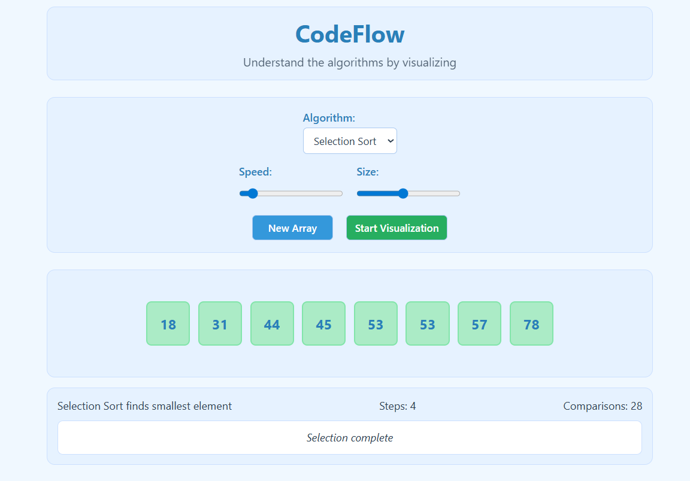

# Algorithm Visualizer

An interactive tool that visualizes how sorting and searching algorithms work.

## Features
- Bubble Sort, Selection Sort, Insertion Sort
- Linear Search, Binary Search
- Real-time step counter and comparisons

## Live Demo
https://manognya-reddy.github.io/CodeFlow/
